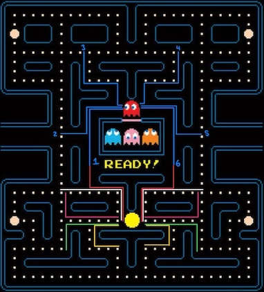

# Agent Minds

Developing accurate and intelligent agents for Pac-Man requires a solid understanding of the game in order to replicate the behaviour of ghosts and also the translation of Pac-Man's behaviours into a rule-based system.

The system has been developed with the intention of allowing hot-swappable agents. This was done so that the application was not coupled to one single agent and so this would allow me to try various different models. The base starting point will be to develop a rule-based agent, while future iterations will look to include some interpretation of a reinforcement learning agent. The hot-swapping also applies to ghosts. It is left open so that should I want to be able to adapt ghost behaviours or even look at developing intelligent ghosts, then this would be possible.

## Game Facts

- All agents have awareness of the entire environment at any time

## Pac-Man

### Core Concepts

Pac-Man is user-controlled, therefore, there are no set rules or behaviours which must be followed. It is totally up to the interpretation of the player. Also, unlike the ghosts, Pac-Man does not have a single target and therefore the decision making at each tick is completely open-ended. Pac-Man's only goal is to collect all of the Pac-Dots without losing all of its lives.

To define this better, Pac-Man should visit all positions on the map which contain a pickup item whilst avoiding contact with ghosts.

### Traditional Theories

There are well-documented [solution patterns](https://www.classicgaming.cc/classics/pac-man/play-guide) for Pac-Man to complete the levels. However, these traditional solutions will not work in this project for a number of reasons:

1) All of the solutions describe exact points and paths that Pac-Man should follow. This is unsuitable for an intelligent agent as no decision making is taking place, the path is already established for them.
2) Ignoring the above issue, these paths (especially at higher levels with faster ghosts) can become "move-perfect" meaning that they are designed to, in some cases, dodge ghosts by a single space in order to make the most effective move. This does not translate from the original game into my version because I am not working on the traditional timing of the game but working with my own implementation of "ticks"

It is therefore obvious, from the above, that I will need to look instead at behaviours and concepts instead of existing solutions if I wish to learn and inherit ideas into making my own solutions.

### Solutions

*The following descriptions apply to a rule-based agent system*

One of the simplest rule-based systems to implement would use a searching algorithm with a heuristic function to quickly filter / decide between paths. The heuristic function I am implementing is a simple path reward value. This reward is a sum of all of the pickup items between the start and end point.

Taking the solution chronologically, one of the hardest decisions the agent will have to make is the starting direction. The image below shows the number of possible paths that Pac-Man could take within 10 ticks.



As can be seen, there are ten different paths which are possible within 10 game ticks as well as 6 (labelled) paths for the first ghost. Even increasing this example by one game tick takes the possible starting options up to 18. Of the displayed ten paths, eight would have an equal reward value and therefore using the reward value alone, Pac-Man would not be able to make a decision on which way to go. This is where pruning would come into play. Knowing the way in which the ghosts move, it would be disadvantageous to choose a path which is likely to bring you into contact with a ghost. Therefore an additional weighting could be given to paths which would take you away from the path of the ghost. This leaves the green and yellow paths as the best possible options. It could also be argued for the white path to be a candidate however it would depend on its next move as only moving straight ahead or downwards (relative to the board) would be considered safe moves as turning right, relative to motion, would bring Pac-Man into a collision course with a ghost.

#### Basic Modifier

The most basic implementation to factor in the ghosts would be to add their score to the path cost function. In order for the ghost score to be correctly implemented, it will be necessary for the function to be aware of Pac-Man's current state. It will need to be known whether Pac-Man is energised so that the score is correctly added / removed. This will change this function to look something like this:

```python
def path_cost(self, path: Path, energised: bool) -> int:
    score = 0
    for node in path:
        if isinstance(node.entity, Pickup):
            score += node.entity.score
        if isinstance(node.entity, Ghost)
            if energised:
                # If there is a ghost and Pac-Man is energised - increase score
                score += node.entity.score
            else:
                # If there is a ghost and Pac-Man is not energised - decrease score
                score -= node.entity.score
    return score
```

#### [Euclidean Distance](https://en.wikipedia.org/wiki/Euclidean_distance)

Looking at a more advanced method to factor in ghosts would be to create a modifier value which is based on the relative distance between Pac-Man and the ghost. To start with, I will look at a solution based off of one single ghost being in play.

For context, the current path reward value is represented as:

$$\sum_{i=s}^{g} entity(v_i)$$

*Where this equation describes the sum of all the entity values between a start ($s$) and goal ($g$) node pair.*

One way of generating this value is to use the [Euclidean Distance](https://en.wikipedia.org/wiki/Euclidean_distance). This is the distance between two points in dimensional space and can be used to calculate the difference between $s$ and $g$ as shown below:

$$d(s,g) = \sqrt{(s_x - g_x)^2 + (s_y - g_y)^2}$$

##### Example

Using the path examples above, a comparison of the Euclidean distance between the yellow and white paths are a good example to show the difference that the distance value could have on a path score. It is assumed for this example that the ghost will attempt to chase Pac-Man and the closest path for both of these routes would be route 1. The distance is therefore measured from the paths final position to the position of the ghost as shown on the example image at (9,5)

The yellow path shows a 10 place movement from (13,23) to (12,26):
$$d(s,g) = \sqrt{(12 - 9)^2 + (26 - 5)^2} = 21.2132$$

The white path shows a 10 place movement from (13,23) to (6,20):
$$d(s,g) = \sqrt{(6 - 9)^2 + (20 - 5)^2} = 15.29706$$

This means that there is a 5.91614 difference between the two distances which can be used to modify the score as needed.

##### Problems

The main problem with using this approach is that the Euclidean distance may not be a true representation of the distance between Pac-Man and a ghost. The additional walls and teleporters within the map mean that the distance from this value could be closer or further away than is what is represented.
