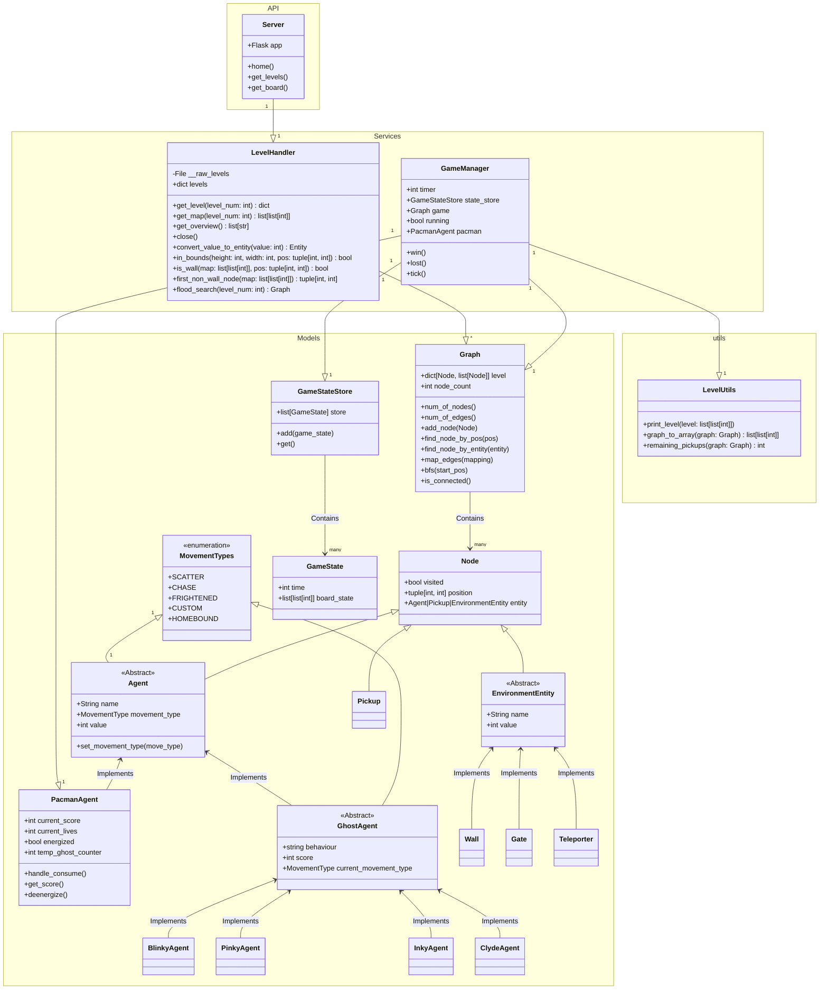

# The Code Base

```mermaid
classDiagram
    direction TD

    namespace API {
        class Server {
            +Flask app
            +home()
            +get_levels()
            +get_board()
        }
    }

    Server "1" --|> "1" LevelHandler

    namespace Services {
        class LevelHandler {
            -File __raw_levels
            +dict levels
            +get_level(level_num: int) dict
            +get_map(level_num: int) list[list[int]]
            +get_overview() list[str]
            +close()
            +convert_value_to_entity(value: int) Entity
            +in_bounds(height: int, width: int, pos: tuple[int, int]) bool
            +is_wall(map: list[list[int]], pos: tuple[int, int]) bool
            +first_non_wall_node(map: list[list[int]]) tuple[int, int]
            +flood_search(level_num: int) Graph
        }

        class GameManager {
            +int timer
            +GameStateStore state_store
            +Graph game
            +bool running
            +PacmanAgent pacman
            +win()
            +lost()
            +tick()
        }
    }

    LevelHandler "1" --|> "*" Graph

    GameManager "1" --|> "1" GameStateStore
    GameManager "1" --|> "1" Graph
    GameManager "1" --|> "1" PacmanAgent
    GameManager "1" --|> "1" LevelUtils

    namespace Models {

        class MovementTypes {
            <<enumeration>>
            +SCATTER
            +CHASE
            +FRIGHTENED
            +CUSTOM
            +HOMEBOUND
        }

        class Agent {
            <<Abstract>>
            +String name
            +MovementType movement_type
            +int value
            +set_movement_type(move_type)
        }

        class PacmanAgent {
            +int current_score
            +int current_lives
            +bool energized
            +int temp_ghost_counter
            +handle_consume()
            +get_score()
            +deenergize()
        }

        class GhostAgent {
            <<Abstract>>
            +string behaviour
            +int score
            +MovementType current_movement_type
        }

        class BlinkyAgent
        class PinkyAgent
        class InkyAgent
        class ClydeAgent


        class EnvironmentEntity {
            <<Abstract>>
            +String name
            +int value
        }
        class Wall
        class Gate
        class Teleporter

        class Pickup {

        }

        class Node {
            +bool visited
            +tuple[int, int] position
            +Agent|Pickup|EnvironmentEntity entity
        }

        class Graph {
            +dict[Node, list[Node]] level
            +int node_count
            +num_of_nodes()
            +num_of_edges()
            +add_node(Node)
            +find_node_by_pos(pos)
            +find_node_by_entity(entity)
            +map_edges(mapping)
            +bfs(start_pos)
            +is_connected()
        }

        class GameState {
            +int time
            +list[list[int]] board_state
        }

        class GameStateStore {
            +list[GameState] store
            +add(game_state)
            +get()
        }

    }
    Agent <-- PacmanAgent : Implements
    Agent <-- GhostAgent : Implements
    GhostAgent <-- BlinkyAgent : Implements
    GhostAgent <-- PinkyAgent : Implements
    GhostAgent <-- InkyAgent : Implements
    GhostAgent <-- ClydeAgent : Implements


    MovementTypes "1" <|-- "1" Agent
    MovementTypes<|--GhostAgent

    EnvironmentEntity <-- Wall : Implements
    EnvironmentEntity <-- Gate : Implements
    EnvironmentEntity <-- Teleporter : Implements

    Node<|--Agent
    Node<|--Pickup
    Node<|--EnvironmentEntity
    Graph --> "many" Node : Contains

    GameStateStore --> "many" GameState : Contains

    namespace utils {
        class LevelUtils {
            +print_level(level: list[list[int]])
            +graph_to_array(graph: Graph) list[list[int]]
            +remaining_pickups(graph: Graph) int
        }
    }
```
