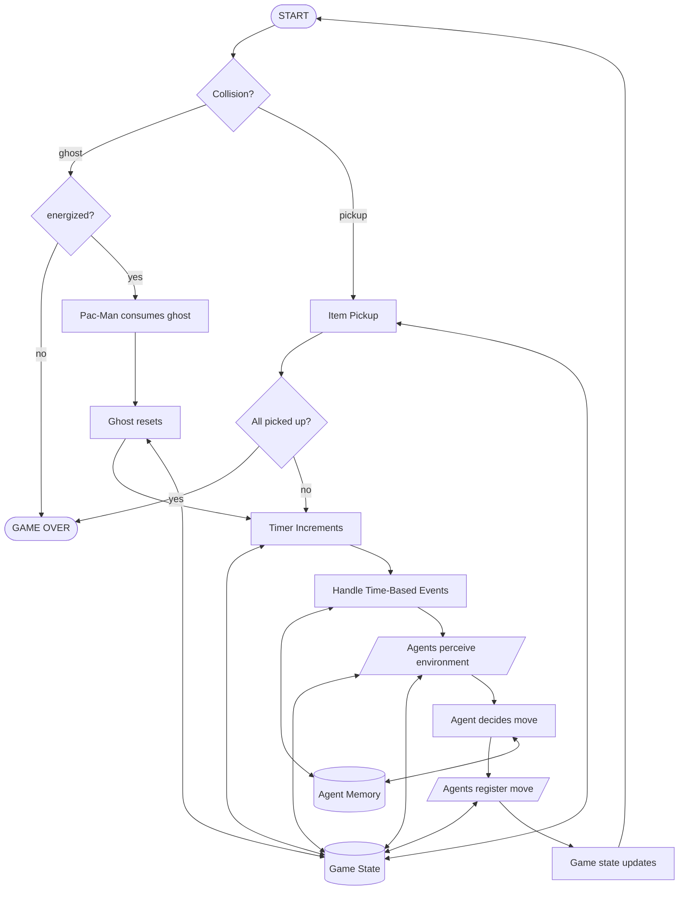

# Game Cycle

Below is a flowchart showing a basic representation of the game cycle. It shows how the game works for a single clock tick and the processes that take place. It should be noted here that "Agent Memory" is a representation for any AI model which is implemented for this simulation. As is the idea of this project, models should be plug and play and therefore the backend works in such a way that the game will be pointed towards a model which will use a universal communication interface to allow information to be passed back and forth. Once the game state is up to date, this should be passed to the model which can use this to produce a move which is passed back to the game to be executed. Ghosts will work in a similar way to the AI Pac-Man agent, however, they will be predetermined and will be the same regardless of configuration.

