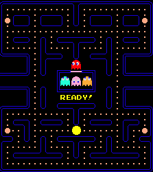
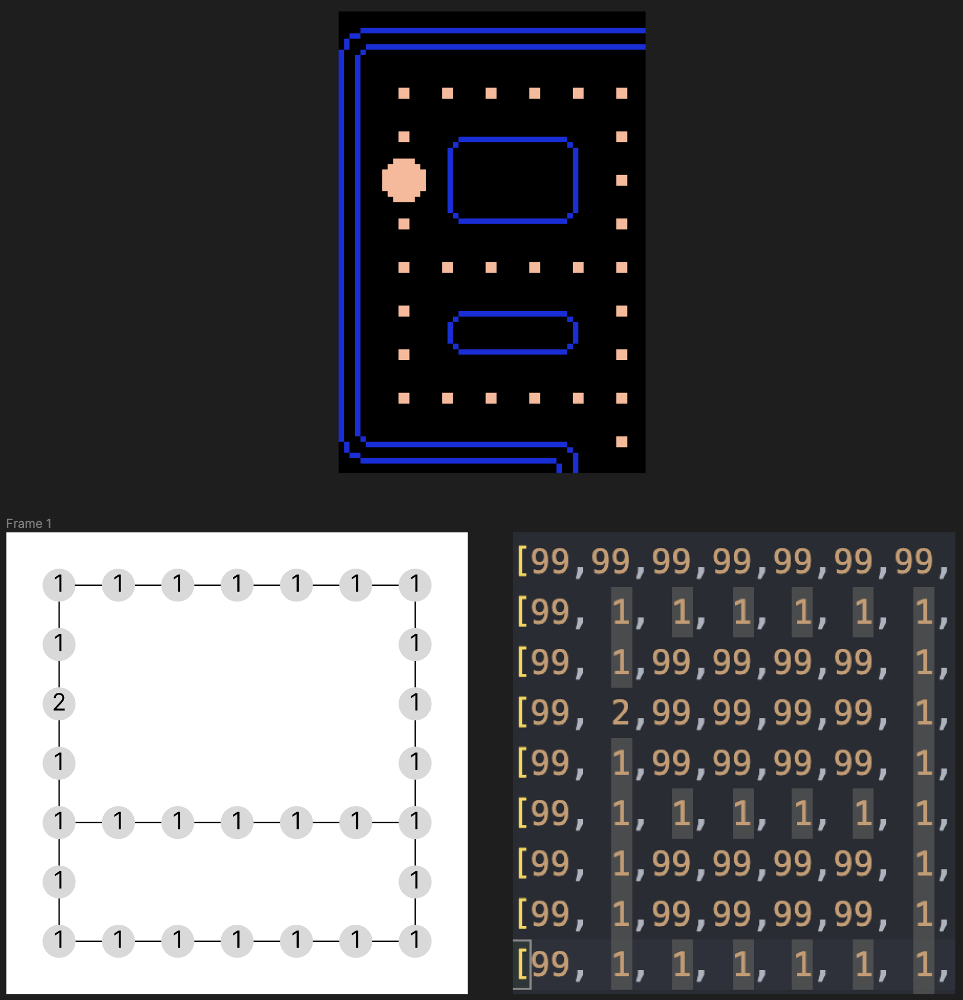

# Level Representation

There are three main ways in which Pac-Man levels are represented in the game.

## Representation to the User

The user will see the level as a canvas generation and will look as close to the real game as possible. All computation is abstracted so that the user is left with the final form. It will look similar to the below example.



## Representation to the Front-End

The front-end application will "see" a two-dimensional array containing a numerical encoding of what is stored in a grid space in the instance represented. It will look like the below snippet and allow for the canvas to build an image, one grid space at a time.

```json
[
    [99,99,99,99,99,99,99,99,99,99,99,99,99,99,99,99,99,99,99,99,99,99,99,99,99,99,99,99],
    [99, 1, 1, 1, 1, 1, 1, 1, 1, 1, 1, 1, 1,99,99, 1, 1, 1, 1, 1, 1, 1, 1, 1, 1, 1, 1,99],
    [99, 1,99,99,99,99, 1,99,99,99,99,99, 1,99,99, 1,99,99,99,99,99,99,99,99,99,99, 1,99],
    [99, 2,99,99,99,99, 1,99,99,99,99,99, 1,99,99, 1,99,99,99,99,99,99,99,99,99,99, 2,99],
    [99, 1,99,99,99,99, 1,99,99,99,99,99, 1,99,99, 1,99,99,99,99,99,99,99,99,99,99, 1,99],
    [99, 1, 1, 1, 1, 1, 1, 1, 1, 1, 1, 1, 1, 1, 1, 1, 1, 1, 1, 1, 1, 1, 1, 1, 1, 1, 1,99],
    [99, 1,99,99,99,99, 1,99,99, 1,99,99,99,99,99,99,99,99, 1,99,99, 1,99,99,99,99, 1,99],
    [99, 1,99,99,99,99, 1,99,99, 1,99,99,99,99,99,99,99,99, 1,99,99, 1,99,99,99,99, 1,99],
    [99, 1, 1, 1, 1, 1, 1,99,99, 1, 1, 1, 1,99,99, 1, 1, 1, 1,99,99, 1, 1, 1, 1, 1, 1,99],
    [99,99,99,99,99,99, 1,99,99,99,99,99, 0,99,99, 0,99,99,99,99,99, 1,99,99,99,99,99,99],
    [99,99,99,99,99,99, 1,99,99,99,99,99, 0,99,99, 0,99,99,99,99,99, 1,99,99,99,99,99,99],
    [99,99,99,99,99,99, 1,99,99, 0, 0, 0, 0,21,99, 0, 0, 0, 0,99,99, 1,99,99,99,99,99,99],
    [99,99,99,99,99,99, 1,99,99, 0,99,99,99,20,20,99,99,99, 0,99,99, 1,99,99,99,99,99,99],
    [99,99,99,99,99,99, 1,99,99, 0,99,99,99,99,99,99,99,99, 0,99,99, 1,99,99,99,99,99,99],
    [88, 0, 0, 0, 0, 0, 1, 0, 0, 0,99,99,99,99,99,99,99,99, 0, 0, 0, 1, 0, 0, 0, 0, 0,88],
    [99,99,99,99,99,99, 1,99,99, 0,99,99,22,23,24,99,99,99, 0,99,99, 1,99,99,99,99,99,99],
    [99,99,99,99,99,99, 1,99,99, 0,99,99,99,99,99,99,99,99, 0,99,99, 1,99,99,99,99,99,99],
    [99,99,99,99,99,99, 1,99,99, 0,99,99,99,99,99,99,99,99, 0,99,99, 1,99,99,99,99,99,99],
    [99,99,99,99,99,99, 1,99,99, 0, 0, 0, 0, 0, 0, 0, 0, 0, 0,99,99, 1,99,99,99,99,99,99],
    [99,99,99,99,99,99, 1,99,99, 0,99,99,99,99,99,99,99,99, 0,99,99, 1,99,99,99,99,99,99],
    [99, 1, 1, 1, 1, 1, 1, 1, 1, 1, 1, 1, 1,99,99, 1, 1, 1, 1, 1, 1, 1, 1, 1, 1, 1, 1,99],
    [99, 1,99,99,99,99, 1,99,99,99,99,99, 1,99,99, 1,99,99,99,99,99, 1,99,99,99,99, 1,99],
    [99, 1,99,99,99,99, 1,99,99,99,99,99, 1,99,99, 1,99,99,99,99,99, 1,99,99,99,99, 1,99],
    [99, 2, 1, 1,99,99, 1, 1, 1, 1, 1, 1, 1,99, 0, 1, 1, 1, 1, 1, 1, 1,99,99, 1, 1, 2,99],
    [99,99,99, 1,99,99, 1,99,99, 1,99,99,99,99,99,99,99,99, 1,99,99, 1,99,99, 1,99,99,99],
    [99,99,99, 1,99,99, 1,99,99, 1,99,99,99,99,99,99,99,99, 1,99,99, 1,99,99, 1,99,99,99],
    [99, 1, 1, 1, 1, 1, 1,99,99, 1, 1, 1, 1,99,99, 1, 1, 1, 1,99,99, 1, 1, 1, 1, 1, 1,99],
    [99, 1,99,99,99,99,99,99,99,99,99,99, 1,99,99, 1,99,99,99,99,99,99,99,99,99,99, 1,99],
    [99, 1,99,99,99,99,99,99,99,99,99,99, 1,99,99, 1,99,99,99,99,99,99,99,99,99,99, 1,99],
    [99, 1, 1, 1, 1, 1, 1, 1, 1, 1, 1, 1, 1, 1, 1, 1, 1, 1, 1, 1, 1, 1, 1, 1, 1, 1, 1,99],
    [99,99,99,99,99,99,99,99,99,99,99,99,99,99,99,99,99,99,99,99,99,99,99,99,99,99,99,99]
]

```

## Representation to the Back-End

In the back-end application, there are actually two ways in which levels are "seen". Firstly, they are stored and initially interacted with as the two-dimensional array shown above. This allows for a compact data structure to be sent to the frontend and also for long-term storage.

However, to actually traverse the map, the array will be translated into a graph which will encode many different values such as the position, what is currently in that space and also any connected pathways. Using a graph in this situation should allow for the leverage of graph traversal algorithms such as Dijkstra's or A* algorithms.


