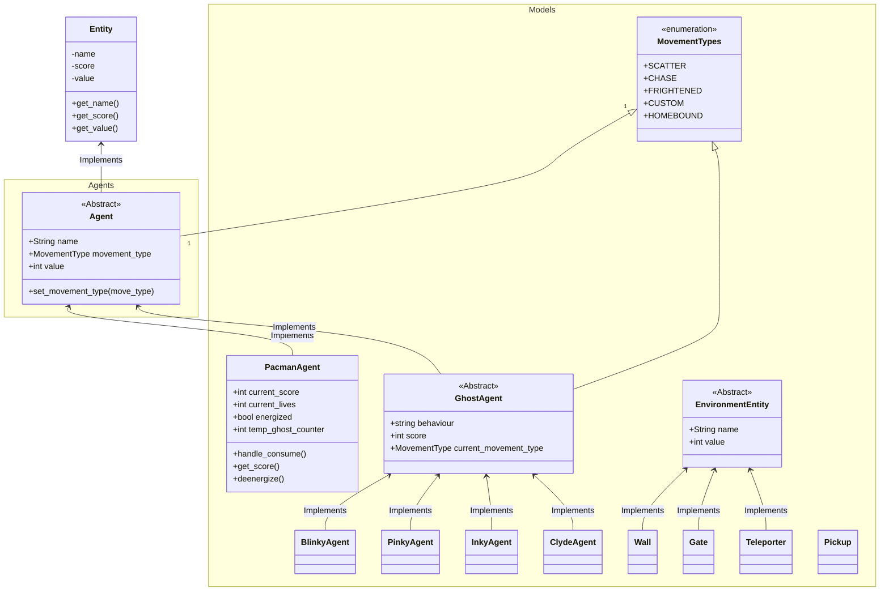

```mermaid
classDiagram
    direction TD

    class Entity {
        -name
        -score
        -value
        +get_name()
        +get_score()
        +get_value()
    }

    Entity <-- Agent : Implements

    namespace Agents {

        class Agent {
            <<Abstract>>
            +String name
            +MovementType movement_type
            +int value
            +set_movement_type(move_type)
        }

    }


    namespace Models {

        class MovementTypes {
            <<enumeration>>
            +SCATTER
            +CHASE
            +FRIGHTENED
            +CUSTOM
            +HOMEBOUND
        }


        class PacmanAgent {
            +int current_score
            +int current_lives
            +bool energized
            +int temp_ghost_counter
            +handle_consume()
            +get_score()
            +deenergize()
        }

        class GhostAgent {
            <<Abstract>>
            +string behaviour
            +int score
            +MovementType current_movement_type
        }

        class BlinkyAgent
        class PinkyAgent
        class InkyAgent
        class ClydeAgent


        class EnvironmentEntity {
            <<Abstract>>
            +String name
            +int value
        }
        class Wall
        class Gate
        class Teleporter

        class Pickup {

        }

    }
    Agent <-- PacmanAgent : Implements
    Agent <-- GhostAgent : Implements
    GhostAgent <-- BlinkyAgent : Implements
    GhostAgent <-- PinkyAgent : Implements
    GhostAgent <-- InkyAgent : Implements
    GhostAgent <-- ClydeAgent : Implements


    MovementTypes "1" <|-- "1" Agent
    MovementTypes<|--GhostAgent

    EnvironmentEntity <-- Wall : Implements
    EnvironmentEntity <-- Gate : Implements
    EnvironmentEntity <-- Teleporter : Implements
```
