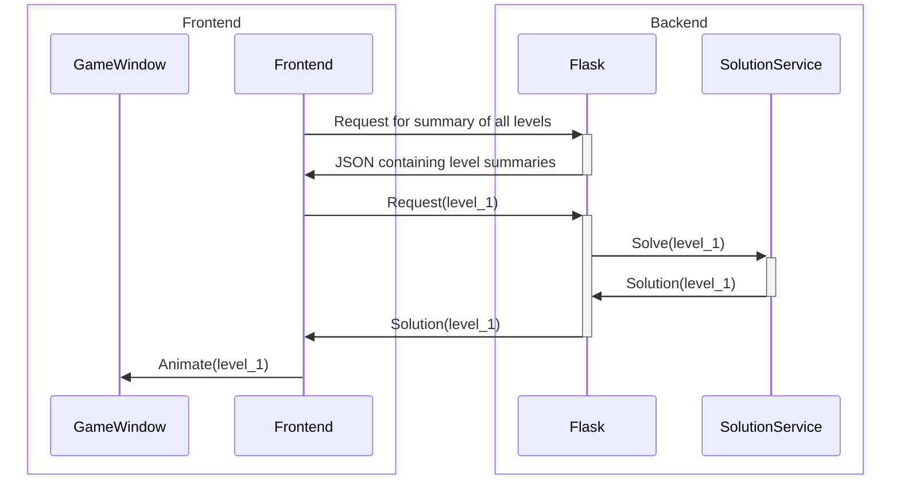

# The Stack

The below sequence diagram shows how the frontend and backend stacks interact with each other on a high level to run the application. This diagram abstracts most of the inner workings of the application to show how the frontend uses the backend API to display to the user the relevant information.

