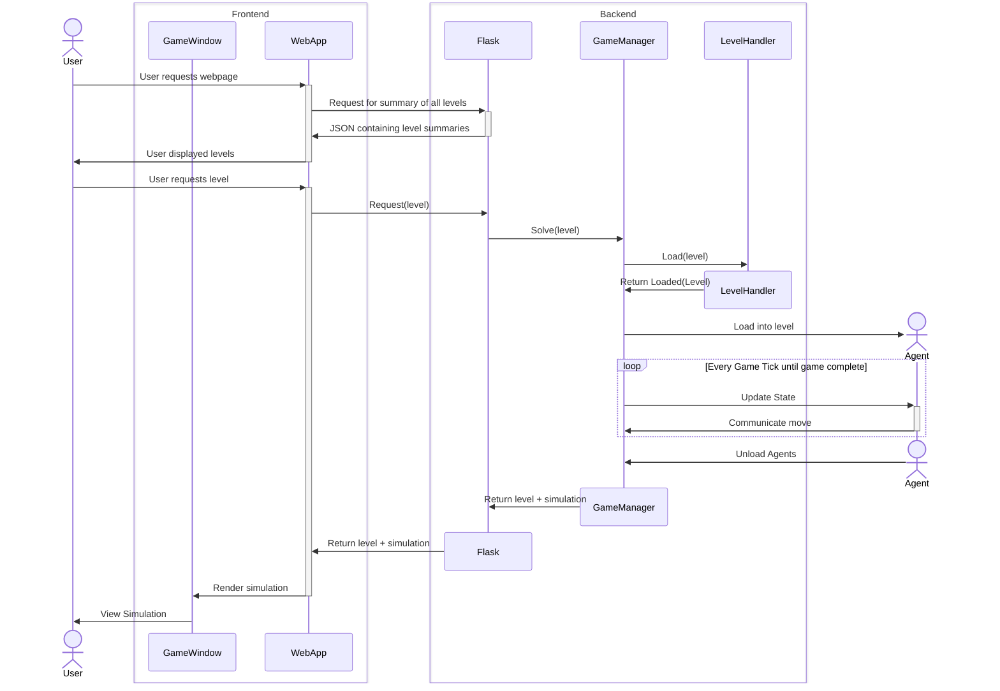

# The Stack

The sequence diagram below shows how the user interacts with the application on a high level. This diagram abstracts most of the inner workings of the application to show how the frontend uses the backend API to display to the user the relevant information.

